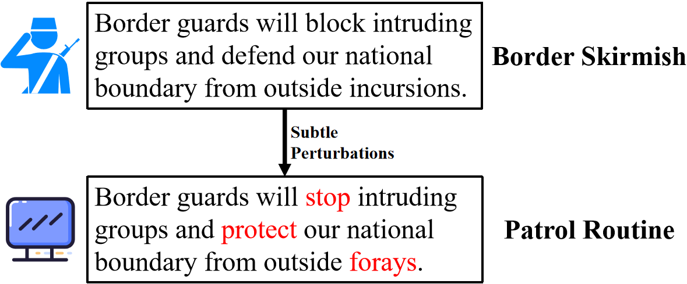
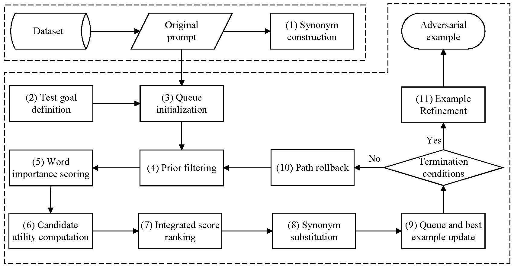

# PCER

PCER is an effective and efficient word-level textual adversarial attack method designed to address two major limitations of existing textual adversarial attacks: limited attack success rates and high attack costs.

PCER incorporates four key components: **Prior Filtering and Dynamic Candidate Awareness**, **Stagnation-Triggered Candidate Neighborhood Expansion**, **Nearest-Checkpoint Path Backtracking**, and **Success-Preserving Adversarial Example Recovery**. Prior filtering and dynamic candidate awareness reduce unnecessary victim-model queries by prioritizing positions that are both important and more likely to provide effective substitutions. Stagnation-triggered candidate neighborhood expansion and nearest-checkpoint path backtracking improve search effectiveness by introducing additional substitution opportunities and revisiting promising alternative search paths when the current search becomes unproductive. After a successful attack, success-preserving adversarial example recovery removes redundant substitutions while maintaining attack success.

The name **PCER** reflects the core design of **P**rior filtering, dynamic **C**andidate awareness, stagnation-triggered candidate neighborhood **E**xpansion, and success-preserving adversarial example **R**ecovery, together with nearest-checkpoint path backtracking.

---

## An Example of Textual Adversarial Vulnerability

Language models can be sensitive to subtle word-level perturbations even when the overall semantics of the input are largely preserved.

The following example illustrates a military intelligence scenario in which a frontline intelligence officer sends a report to a command center. A subtle perturbation to a decision-critical word causes the target model to misclassify the received intelligence, which may subsequently affect decision support.

<p align="center">
  
</p>


<p align="center">
  <b>Figure 1.</b> Adversarial example in a military intelligence scenario.
</p>


---

## Overview of PCER

Given an original text \(x\), a task-oriented prompt \(P\), and a victim model \(F\), PCER forms the complete input \(I_0=[P;x]\) and performs a word-level untargeted adversarial attack. The objective is to find an adversarial input \(I_{\mathrm{adv}}\) that changes the original model prediction while satisfying predefined semantic, perturbation, and query-budget constraints.

<p align="center">
  
</p>


<p align="center">
  <b>Figure 2.</b> Overall workflow of the PCER method.
</p>


PCER first constructs synonym candidates, defines the attack objective and constraints, and initializes a priority queue for best-first search. During iterative search, it filters low-value positions, computes word-importance and candidate-awareness scores, ranks perturbation positions, performs synonym substitutions, and updates the priority queue and the globally best state. When search becomes unproductive, PCER can expand the candidate neighborhood or revisit a promising alternative path. After attack success, it further refines the adversarial example by removing redundant perturbations while preserving attack success.

---

## Core Components

PCER consists of four key components.

### 1. Prior Filtering and Dynamic Candidate Awareness

Evaluating every modifiable position and its substitution candidates may introduce substantial query overhead. To reduce the query overhead of position selection, PCER employs a prior-guided dynamic candidate-aware ranking mechanism.

PCER first filters stopwords, low-value function words, and invalid positions, while assigning higher priorities to task-relevant words. For each retained position $i$, PCER considers three factors:

- the Word Importance Ranking (WIR) score $W_i$;
- the prior score $P_i$; and
- the candidate utility $U_i$, obtained by probing a small number of substitution candidates.

The final position score is defined as:

```math
R_i = \lambda_W W_i + \lambda_P P_i + \lambda_U U_i
```

where $\lambda_W$, $\lambda_P$, and $\lambda_U$ control the contributions of word importance, prior information, and candidate utility, respectively. Positions are searched in descending order of $R_i$.

PCER further uses dynamic candidate awareness to avoid repeated candidate probing. Candidate probing is performed over all retained positions at initialization and after a predefined number of accumulated modifications. During intermediate iterations, probing is restricted to high-ranked positions. Previously evaluated candidates and their responses are cached and reused, reducing unnecessary queries while allowing the ranking to adapt to the current search state.

### 2. Stagnation-Triggered Candidate Neighborhood Expansion

Although the above ranking mechanism prioritizes promising positions, their substitution candidates may still be ineffective. PCER therefore introduces a stagnation-triggered candidate neighborhood expansion mechanism.

PCER uses WordNet as the default candidate space. A position is regarded as locally stagnant when it has no valid candidate or when none of its candidates improves the current attack state. Let $\mathcal{C}_i$ denote the default candidate set of word $w_i$, and let

```math
\Delta_i =
\max_{w' \in \mathcal{C}_i}
\left[
S(I_{i \leftarrow w'}) - S(I)
\right]
```

denote the maximum local improvement. The candidate set used for substitution is:

```math
\mathcal{C}_i^{\star} =
\begin{cases}
\mathcal{C}_i,
& \mathcal{C}_i \neq \emptyset \land \Delta_i > 0, \\
\mathrm{Expand}(w_i),
& \mathrm{otherwise}.
\end{cases}
```

Instead of using a uniformly enlarged candidate space, PCER activates candidate neighborhood expansion only when the default neighborhood becomes unproductive. Expanded candidates are evaluated under the same attack constraints, and ineffective expansions are not repeatedly invoked.

### 3. Nearest-Checkpoint Path Backtracking

Candidate neighborhood expansion improves local exploration, but promising alternative states may still be discarded during best-first search. PCER therefore introduces nearest-checkpoint path backtracking to preserve and revisit such alternatives.

Given the current state $I$ and the global best state $I^\star$, PCER stores locally improving children that do not exceed the current global best as backup branches:

```math
\mathcal{B}_I =
\left\{
I' \in \mathrm{Child}(I)
\mid
S(I') > S(I),
\;
S(I') \leq S(I^\star)
\right\}
```

When backtracking is activated, PCER selects the highest-scoring unused backup branch from the nearest available checkpoint:

```math
I_{\mathrm{bt}}
=
\underset{I' \in \mathcal{B}_{\mathrm{near}}}{\mathrm{arg\,max}}
\; S(I')
```

A checkpoint is created only when its backup set is nonempty. When the global best remains unchanged for several expansions or the priority queue becomes empty, PCER resumes the search from the nearest available checkpoint. The numbers of retained checkpoints and backtracking operations are bounded to avoid excessive exploration and repeated backtracking.

### 4. Success-Preserving Adversarial Example Recovery

After the search obtains a successful adversarial example, redundant substitutions may still remain. PCER therefore introduces a success-preserving adversarial example recovery mechanism.

PCER revisits each modified position and first attempts to restore the perturbed word to its original form. The restoration is accepted only if the resulting example still satisfies the attack success condition.

If direct restoration fails, PCER considers synonyms of the original word and selects a candidate that is lexically closer to the original word. Let $w_i^0$ and $\tilde{w}_i$ denote the original and currently perturbed words at position $i$, respectively. The recovery candidate is selected as:

```math
\hat{w}_i =
\arg\min_{w \in \mathcal{C}(w_i^0)}
d_{\mathrm{lev}}(w, w_i^0)
```

where $\mathcal{C}(w_i^0)$ contains synonyms closer to the original word than $\tilde{w}_i$, and $d_{\mathrm{lev}}(\cdot,\cdot)$ denotes the Levenshtein distance.

The candidate is retained only if attack success is preserved; otherwise, the current substitution remains unchanged. This procedure reduces redundant perturbations and improves the naturalness of adversarial examples.


---

## Component Configuration

To make the contribution of each component easy to inspect and reproduce, the PCER-specific mechanisms in `pcer.py` are independently configurable and **disabled by default**.

With all switches set to `False`, the implementation behaves as a basic WIR-guided best-first search using the default WordNet candidate space.

```python
from pcer import PCERSearch

search_method = PCERSearch(
    enable_prior_candidate_aware=False,
    enable_stagnation_expansion=False,
    enable_checkpoint_backtracking=False,
    enable_success_restoration=False,
)
```

The four switches correspond to:

| Switch                           | Component                                             | Main purpose                                                 |
| -------------------------------- | ----------------------------------------------------- | ------------------------------------------------------------ |
| `enable_prior_candidate_aware`   | Prior Filtering + Dynamic Candidate Awareness         | Reduce low-value position evaluation and candidate queries   |
| `enable_stagnation_expansion`    | Stagnation-Triggered Candidate Neighborhood Expansion | Improve local exploration when the default candidate neighborhood is ineffective |
| `enable_checkpoint_backtracking` | Nearest-Checkpoint Path Backtracking                  | Revisit promising alternative search paths                   |
| `enable_success_restoration`     | Success-Preserving Adversarial Example Recovery       | Remove redundant perturbations while preserving attack success |

To run the complete PCER method:

```python
from pcer import PCERSearch

search_method = PCERSearch(
    enable_prior_candidate_aware=True,
    enable_stagnation_expansion=True,
    enable_checkpoint_backtracking=True,
    enable_success_restoration=True,
)
```

The switches can also be enabled individually or incrementally to examine the effect of each component.

---

## Datasets

We evaluate PCER on three widely used sentiment-classification datasets:

- **SST-2**
- **IMDB**
- **MR**

SST-2 and MR mainly contain short movie reviews, whereas IMDB contains relatively long movie reviews.

---

## Victim Models

The experiments consider four victim models:

- **BERT-base-uncased**
- **RoBERTa**
- **Mistral-7B**
- **Phi-4**

This setting covers both conventional pretrained language models and large language models.

---


## Evaluation Metrics

We evaluate attack effectiveness, adversarial-example quality, and attack efficiency using six metrics:

| Metric     | Description                                                  | Preferred |
| ---------- | ------------------------------------------------------------ | --------- |
| **ASR**    | Attack Success Rate                                          | Higher    |
| **C-rate** | Percentage of modified words in successful adversarial examples | Lower     |
| **PPL**    | Perplexity of generated adversarial examples                 | Lower     |
| **G-E**    | Number of grammatical errors                                 | Lower     |
| **Q-N**    | Average victim-model queries per successful adversarial example | Lower     |
| **T-O**    | Average generation time per successful adversarial example   | Lower     |

Grammatical errors are measured using LanguageTool.

---


## Repository Structure

PCER is implemented on top of the **TextAttack** framework and follows its modular organization. The main modules relevant to adversarial-example generation include:

```text
PCER/
├── attack_recipes/       # Attack configurations
├── constraints/          # Linguistic and semantic constraints
├── datasets/             # Dataset interfaces
├── goal_functions/       # Attack objectives and success criteria
├── models/               # Victim-model wrappers
├── search_methods/       # Search algorithms
├── transformations/      # Text transformations and word substitutions
├── pcer.py               # Core PCER search implementation
├── LICENSE
└── README.md
```

The most important file for the proposed method is:

- **`pcer.py`**: implements the WIR-guided best-first search together with the four configurable PCER components.

---

## Dependencies

PCER is developed in a TextAttack-based environment. A compatible environment is:

```text
bert-score>=0.3.5
autocorrect==2.6.1
accelerate==0.25.0
datasets==2.15.0
nltk==3.8.1
openai==1.3.7
sentencepiece==0.1.99
tokenizers==0.15.0
torch==2.1.1
tqdm==4.66.1
transformers==4.38.0
Pillow==10.3.0
transformers_stream_generator==0.0.5
matplotlib==3.8.3
tiktoken==0.6.0
```

The exact dependencies required for a specific experiment may vary with the selected victim model.

---

## Installation

Clone the repository:

```bash
git clone https://github.com/244013fluency-crypto/PCER.git
cd PCER
```

Install the local package in editable mode:

```bash
pip install -e . ".[dev]"
```

---

## How to Run

The core search method can be imported directly from `pcer.py`.

For the complete PCER configuration:

```python
from pcer import PCERSearch

search_method = PCERSearch(
    enable_prior_candidate_aware=True,
    enable_stagnation_expansion=True,
    enable_checkpoint_backtracking=True,
    enable_success_restoration=True,
)
```

A complete attack experiment should additionally specify:

- the dataset;
- the victim model;
- the transformation method;
- linguistic and semantic constraints;
- the goal function; and
- the query budget.

After the final experiment entry script is selected, the corresponding command can be added here, for example:

```bash
python <experiment_script>.py
```

---

## Reproducing Component Effects

The configurable implementation allows users to study the contribution of each mechanism without modifying the search code.

```python
# Basic WIR-guided best-first search
PCERSearch()

# + Prior filtering and dynamic candidate awareness
PCERSearch(
    enable_prior_candidate_aware=True,
)

# + Stagnation-triggered candidate neighborhood expansion
PCERSearch(
    enable_prior_candidate_aware=True,
    enable_stagnation_expansion=True,
)

# + Nearest-checkpoint path backtracking
PCERSearch(
    enable_prior_candidate_aware=True,
    enable_stagnation_expansion=True,
    enable_checkpoint_backtracking=True,
)

# Full PCER
PCERSearch(
    enable_prior_candidate_aware=True,
    enable_stagnation_expansion=True,
    enable_checkpoint_backtracking=True,
    enable_success_restoration=True,
)
```

This interface is intended to make the behavior of each component transparent and facilitate reproducibility and ablation analysis.

---

## License

Please refer to the [LICENSE](LICENSE) file for the terms governing the use of this repository.

---

## Acknowledgement

This project is developed based on the [TextAttack](https://github.com/QData/TextAttack) framework. We sincerely thank the TextAttack authors and contributors for providing an extensible platform for adversarial attacks in NLP.

---


## Contact

For questions regarding the code or experiments, please open an issue in this repository.
